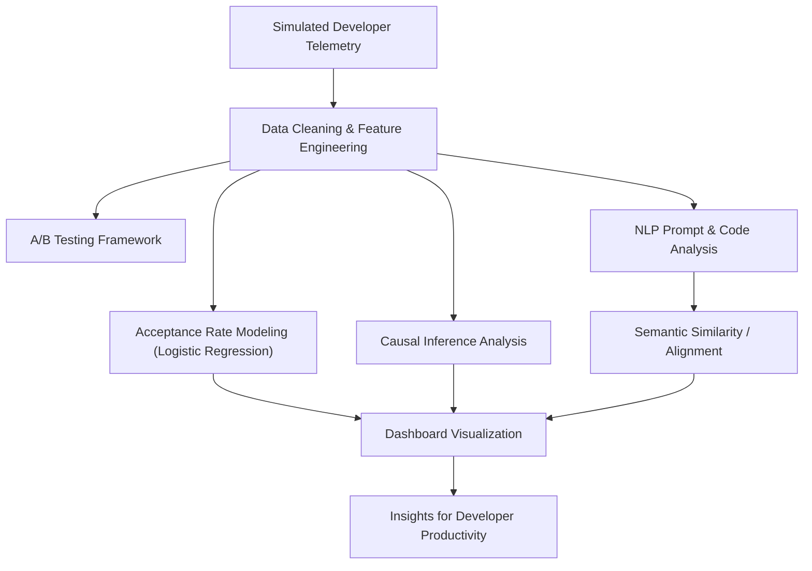

# OpenAI Codex Data Scientist Showcase  
A complete, end-to-end portfolio demonstrating the skills required for the **OpenAI Data Scientist – Codex / Developer Tools** role.

This repo simulates how a Codex DS analyzes developer telemetry, evaluates LLM code generation, runs causal inference, and measures developer productivity.

---

## 🎯 Who Is This Repo For?

This repository is designed for different audiences, each with a tailored entry point:

### � Quick Start (5 min)
**👉 [/docs/01_QUICK_START.md](/docs/01_QUICK_START.md)**  
Get up and running in minutes. Perfect for recruiters or anyone who wants a quick overview.

### � Developer Analytics Guide  
**👉 [/docs/02_DEVELOPER_ANALYTICS_GUIDE.md](/docs/02_DEVELOPER_ANALYTICS_GUIDE.md)**  
Comprehensive walkthrough of the developer telemetry, model evaluation, and analytics pipeline.

### � NLP & Code Analysis  
**👉 [/docs/03_NLP_ANALYSIS.md](/docs/03_NLP_ANALYSIS.md)**  
Deep dive into the NLP techniques used for code generation evaluation and analysis.

### 🎯 Project Showcase  
**👉 [/docs/04_SHOWCASE_SUMMARY.md](/docs/04_SHOWCASE_SUMMARY.md)**  
How this project demonstrates key data science skills for AI-powered developer tools.

### 🧠 Technical Deep Dives  
**👉 [/docs/05_METHODOLOGY.md](/docs/05_METHODOLOGY.md)**  
In-depth technical methodology, experimental design, and causal inference approaches.

---

## 🏗️ Project Architecture (End-to-End Pipeline)

